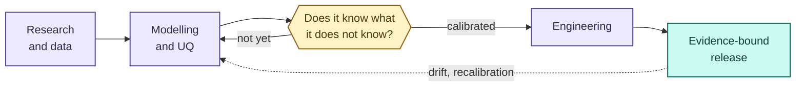

<!-- Hero. Generated by scripts/make_hero.py — edit that, not the SVGs. -->

  <picture>
    <source media="(prefers-color-scheme: dark)" srcset="assets/hero-dark.svg">
    <source media="(prefers-color-scheme: light)" srcset="assets/hero-light.svg">
    
  </picture>

  

  
  
  
  
  
  

---

I work on the part that comes after a model trains: whether it is calibrated,
whether anyone should trust a given prediction, and what happens when the world
moves away from the data it learned on.

  <picture>
    <source media="(prefers-color-scheme: dark)" srcset="assets/stack-dark.svg">
    <source media="(prefers-color-scheme: light)" srcset="assets/stack-light.svg">
    
  </picture>

  

## How the work is shaped

Most of what is here carries its own evidence. Where a repository publishes a
number, something in it checks that number against the files that produced it,
because a figure in a README that nothing verifies is a claim, not a result.

**[mzquadri.de](https://mzquadri.de)** has the case studies and what each one
does not establish.

## Currently

<!-- AUTO:now:start -->
- **[insureassist-rag-mlops](https://github.com/mzquadri/insureassist-rag-mlops)** — Measured RAG reference implementation over NFIP policy forms: BGE + BM25 hybrid retrieval, FastAPI,… `today` · Python
- **[drift-aware-ml-platform](https://github.com/mzquadri/drift-aware-ml-platform)** — Hourly demand forecasting that detects concept drift in its own target and retrains itself `yesterday` · Python
- **[mcp-policy-gateway](https://github.com/mzquadri/mcp-policy-gateway)** — Runtime policy enforcement and adversarial evaluation for MCP tool calls `yesterday` · Python
<!-- AUTO:now:end -->

Rebuilt daily from push timestamps, so it cannot quietly go stale.

## A few things worth opening

| | |
|---|---|
| [**ml_surrogates_for_agent_based_transport_models**](https://github.com/mzquadri/ml_surrogates_for_agent_based_transport_models) | M.Sc. thesis. Six uncertainty-quantification methods on a graph neural network traffic surrogate. Calibration error down **90.5%**; withholding the least reliable half of predictions cuts MAE by **41.2%**. Forked from the chair's repository, with my contribution separated out in the README. |
| [**mcp-policy-gateway**](https://github.com/mzquadri/mcp-policy-gateway) | Runtime policy enforcement for Model Context Protocol tool calls. Catches **96.2%** of an adversarial corpus at a **9.5%** false positive rate, against a keyword baseline at **38.5%**. **Three scored misses** are kept in the corpus rather than removed. |
| [**insureassist-rag-mlops**](https://github.com/mzquadri/insureassist-rag-mlops) | Retrieval over insurance policy documents, with citations that resolve to exact character offsets. Hybrid BM25 and dense retrieval; top-document accuracy **0.556**, up **3.3× from the 0.167 starting point**. Hit rate@5 did not improve, and the repository says so. |
| [**drift-aware-ml-platform**](https://github.com/mzquadri/drift-aware-ml-platform) | Demand forecasting that watches its own target for drift. On this data only 9% of input features move while the target moves **0.679**, so a feature-only monitor would miss a **63% rise** in demand. |
| [**munich-accident-forecasting**](https://github.com/mzquadri/munich-accident-forecasting) | Munich road accident forecasting behind a FastAPI service. CI re-runs the pipeline and fails the build unless it reproduces the committed reference run to **1e-9**. |
| [**UQ-Hydrology-Seminar-TUM**](https://github.com/mzquadri/UQ-Hydrology-Seminar-TUM) | Group seminar on uncertainty in a calibrated rainfall-runoff model. Rainfall noise barely touches the fit; measurement error in the observed discharge costs **0.148 NSE** and recalibration recovers **5.76%** of it. |

<!-- AUTO:claims:start -->
`13/13` figures on this page were re-checked against the file that produced them, by the workflow that built this line.

Which number comes from which file

| | Claim | Source of record | Value |
|---|---|---|---|
| ✅ | `mcp-caught` | [`mcp-policy-gateway/assets/summary.json`](https://github.com/mzquadri/mcp-policy-gateway/blob/main/assets/summary.json) | 0.9615 |
| ✅ | `mcp-false-block` | [`mcp-policy-gateway/assets/summary.json`](https://github.com/mzquadri/mcp-policy-gateway/blob/main/assets/summary.json) | 0.0952 |
| ✅ | `mcp-keyword-baseline` | [`mcp-policy-gateway/assets/summary.json`](https://github.com/mzquadri/mcp-policy-gateway/blob/main/assets/summary.json) | 0.3846 |
| ✅ | `mcp-unhandled` | [`mcp-policy-gateway/assets/summary.json`](https://github.com/mzquadri/mcp-policy-gateway/blob/main/assets/summary.json) | 3 |
| ✅ | `rag-top-doc` | [`insureassist-rag-mlops/eval/reference_run.json`](https://github.com/mzquadri/insureassist-rag-mlops/blob/main/eval/reference_run.json) | 0.5556 |
| ✅ | `rag-starting-point` | [`insureassist-rag-mlops/docs/BENCHMARK.md`](https://github.com/mzquadri/insureassist-rag-mlops/blob/main/docs/BENCHMARK.md) | matched |
| ✅ | `thesis-ece` | [`ml_surrogates_for_agent_based_transport_models/docs/UQ_SUMMARY.md`](https://github.com/mzquadri/ml_surrogates_for_agent_based_transport_models/blob/main/docs/UQ_SUMMARY.md) | matched |
| ✅ | `thesis-selective-mae` | [`ml_surrogates_for_agent_based_transport_models/docs/UQ_SUMMARY.md`](https://github.com/mzquadri/ml_surrogates_for_agent_based_transport_models/blob/main/docs/UQ_SUMMARY.md) | matched |
| ✅ | `drift-target` | [`drift-aware-ml-platform/README.md`](https://github.com/mzquadri/drift-aware-ml-platform/blob/main/README.md) | matched |
| ✅ | `drift-blind-spot` | [`drift-aware-ml-platform/README.md`](https://github.com/mzquadri/drift-aware-ml-platform/blob/main/README.md) | matched |
| ✅ | `munich-reproduction` | [`munich-accident-forecasting/README.md`](https://github.com/mzquadri/munich-accident-forecasting/blob/main/README.md) | matched |
| ✅ | `hydro-nse-cost` | [`UQ-Hydrology-Seminar-TUM/README.md`](https://github.com/mzquadri/UQ-Hydrology-Seminar-TUM/blob/main/README.md) | 0.1484 |
| ✅ | `hydro-recovery` | [`UQ-Hydrology-Seminar-TUM/README.md`](https://github.com/mzquadri/UQ-Hydrology-Seminar-TUM/blob/main/README.md) | matched |

<!-- AUTO:claims:end -->

## Writing

<b>Notes on reliable AI, calibration and production engineering</b>

<!-- AUTO:writing:start -->
**13 pieces** at [mzquadri.de/learn](https://mzquadri.de/learn), grouped by what they are about.

**Backend and Distributed Systems**

- [Designing Replay as a Normal Path](https://mzquadri.de/learn/designing-replay-as-a-normal-path)
- [Idempotent Ingestion Across Heterogeneous Stores](https://mzquadri.de/learn/idempotent-ingestion-across-heterogeneous-stores)

**Document Intelligence**

- [Template-Driven Document Extraction With LLMs](https://mzquadri.de/learn/template-driven-document-extraction)

**Explainable AI**

- [What a Saliency Map Does Not Prove](https://mzquadri.de/learn/what-a-saliency-map-does-not-prove)

**MLOps**

- [Promotion Gates for Model Release](https://mzquadri.de/learn/promotion-gates-for-model-release)

**Machine Learning**

- [Calibration Is Not Classification Accuracy](https://mzquadri.de/learn/calibration-is-not-classification-accuracy)

**Reliable AI Systems**

- [Building an Independent Verification Oracle](https://mzquadri.de/learn/building-an-independent-verification-oracle)
- [Equal Counts Do Not Prove Two Stores Agree](https://mzquadri.de/learn/equal-counts-do-not-prove-two-stores-agree)
- [Evidence Provenance for Knowledge Systems](https://mzquadri.de/learn/evidence-provenance-for-knowledge-systems)
- [Production AI Systems Need Refusal Paths](https://mzquadri.de/learn/refusal-paths-in-production-ai-systems)
- [Re-ingest, Verify, Reconcile, Withdraw](https://mzquadri.de/learn/reingest-verify-reconcile-withdraw)

**Retrieval and Grounded Generation**

- [Hybrid Retrieval Without Silent Failure](https://mzquadri.de/learn/hybrid-retrieval-without-silent-failure)

**Uncertainty Quantification**

- [Selective Prediction: When Models Should Abstain](https://mzquadri.de/learn/selective-prediction-when-models-should-abstain)
<!-- AUTO:writing:end -->

<b>Every public repository</b>

<!-- AUTO:index:start -->
| Repository | Language | Last pushed | |
|---|---|---|---|
| [`insureassist-rag-mlops`](https://github.com/mzquadri/insureassist-rag-mlops) | Python | today | Measured RAG reference implementation over NFIP policy forms: BGE + BM25 hybrid retrieval, FastAPI, Qdrant, reproducible evaluation, Docker and… |
| [`drift-aware-ml-platform`](https://github.com/mzquadri/drift-aware-ml-platform) | Python | yesterday | Hourly demand forecasting that detects concept drift in its own target and retrains itself. MLflow registry aliases, Evidently, Airflow,… |
| [`mcp-policy-gateway`](https://github.com/mzquadri/mcp-policy-gateway) | Python | yesterday | Runtime policy enforcement and adversarial evaluation for MCP tool calls |
| [`MLOps-End-to-End-Pipeline`](https://github.com/mzquadri/MLOps-End-to-End-Pipeline) | Python | 4 days ago | End-to-end ML lifecycle on a licensed dataset: validation, leak-free feature fitting, a promotion gate that can refuse, immutable model bundles, a… |
| [`munich-accident-forecasting`](https://github.com/mzquadri/munich-accident-forecasting) | Python | 5 days ago | Monthly forecasts for Munich road accident counts, per accident category, with a temporal split, baseline comparison and a FastAPI service |
| [`ml_surrogates_for_agent_based_transport_models`](https://github.com/mzquadri/ml_surrogates_for_agent_based_transport_models) fork | Python | 6 days ago | M.Sc. thesis: Uncertainty Quantification for GNN Surrogates of Agent-Based Transport Models (TUM, 2026) |
| [`ZQ`](https://github.com/mzquadri/ZQ) | TypeScript | 9 days ago | Personal portfolio source with curated, traceable project links and scoped results |
| [`UQ-Hydrology-Seminar-TUM`](https://github.com/mzquadri/UQ-Hydrology-Seminar-TUM) | Jupyter Notebook | 13 days ago | TUM group seminar project on mathematical uncertainty quantification in hydrology |
| [`Deep-Learning-Flood-Prediction-LSTM`](https://github.com/mzquadri/Deep-Learning-Flood-Prediction-LSTM) | Python | 13 days ago | Controlled LSTM time-series experiment on a synthetic catchment: next-day discharge forecasting scored against day-of-year, persistence and linear… |
| [`Time-Series-Streamflow-Forecasting`](https://github.com/mzquadri/Time-Series-Streamflow-Forecasting) | Python | 13 days ago | Forecasting benchmark on a synthetic daily streamflow series: XGBoost loses to predicting yesterday, a ridge model wins, and the original… |
| [`jobhunter`](https://github.com/mzquadri/jobhunter) | Python | 13 days ago | Finds AI/ML jobs worth applying to, scores them against your CV, and drafts the cover letter. FastAPI + Next.js + Postgres on Docker Compose. |
| [`Neural-Network-Identifiability-Analysis`](https://github.com/mzquadri/Neural-Network-Identifiability-Analysis) | Python | 3 weeks ago | Numerical verification of neural network parameter symmetries: which transformations leave the represented function unchanged, for tanh, sigmoid… |
| [`Battery-SOC-Estimation-ML`](https://github.com/mzquadri/Battery-SOC-Estimation-ML) | Python | 3 weeks ago | How a state-of-charge benchmark reports a convincing number without the model learning anything: the split, and four features that restate the… |
| [`Insurance-Claims-Prediction-ML`](https://github.com/mzquadri/Insurance-Claims-Prediction-ML) | Python | 3 weeks ago | Measuring what it costs to choose a decision threshold and a calibrator on the set you report them on. Generated portfolio, known true… |
| [`ML-Water-Quality-Classification`](https://github.com/mzquadri/ML-Water-Quality-Classification) | Python | 3 weeks ago | Synthetic-data classification demonstration; not evidence for water-safety decisions |
| [`Weather-Data-Analytics-EDA`](https://github.com/mzquadri/Weather-Data-Analytics-EDA) | Python | 3 weeks ago | Deterministic synthetic-weather exploratory analysis and visualization demonstration |
| [`Supply-Chain-Analytics-Dashboard`](https://github.com/mzquadri/Supply-Chain-Analytics-Dashboard) | Python | 3 weeks ago | Exploratory supply-chain analytics prototype with explicit proxy metrics and chronological evaluation |
| [`medico`](https://github.com/mzquadri/medico) | Python | 3 weeks ago | Research training script for multi-label chest X-ray classification across CheXpert, NIH ChestX-ray14 and a pneumonia set, with masked labels and… |
| [`ai-engineering-portfolio`](https://github.com/mzquadri/ai-engineering-portfolio) | HTML | 3 weeks ago | Architecture case studies from AI engineering systems I contributed to, spanning verifiable legal knowledge, document intelligence, AI compliance,… |
| [`snake-water-gun`](https://github.com/mzquadri/snake-water-gun) | Python | 3 weeks ago | Small command-line Snake, Water, Gun Python learning exercise |
| [`Statistical-Learning-Transportation`](https://github.com/mzquadri/Statistical-Learning-Transportation) | Jupyter Notebook | 4 weeks ago | Coursework for Statistical Learning and Data Analytics for Transportation Systems (M.Sc. Mathematics in Science and Engineering, TUM) - Problem… |
| [`CNN-Image-Classification-PyTorch`](https://github.com/mzquadri/CNN-Image-Classification-PyTorch) | Python | 4 weeks ago | CIFAR-10 custom CNN reference experiment with tracked evaluation artifacts |
| [`NLP-Text-Classification-Transformers`](https://github.com/mzquadri/NLP-Text-Classification-Transformers) | Python | 4 weeks ago | AG News text-classification experiment with explicit synthetic fixture for offline development |
| [`colpali`](https://github.com/mzquadri/colpali) fork | — | 6 weeks ago | The code used to train and run inference with the ColVision models, e.g. ColPali, ColQwen2, and ColSmol. |
| [`iftaar-invitation-2026`](https://github.com/mzquadri/iftaar-invitation-2026) | HTML | 2 months ago | Private event-specific static Iftaar invitation for 2026 |
| [`express`](https://github.com/mzquadri/express) fork | — | 11 months ago | Fast, unopinionated, minimalist web framework for node. |

26 public repositories, including the learning exercises. A list that dropped them would be saying something else.
<!-- AUTO:index:end -->

## Contribution graph

<picture>
  <source media="(prefers-color-scheme: dark)" srcset="https://raw.githubusercontent.com/mzquadri/mzquadri/output/github-snake-dark.svg">
  <source media="(prefers-color-scheme: light)" srcset="https://raw.githubusercontent.com/mzquadri/mzquadri/output/github-snake.svg">
  
</picture>

## Statistics

  <picture>
    <source media="(prefers-color-scheme: dark)" srcset="https://github-readme-stats.vercel.app/api?username=mzquadri&show_icons=true&hide_border=true&theme=github_dark&icon_color=14B8A6&title_color=14B8A6&include_all_commits=true&rank_icon=github">
    
  </picture>
  <picture>
    <source media="(prefers-color-scheme: dark)" srcset="https://github-readme-stats.vercel.app/api/top-langs/?username=mzquadri&layout=compact&hide_border=true&theme=github_dark&title_color=14B8A6&langs_count=8">
    
  </picture>

  <picture>
    <source media="(prefers-color-scheme: dark)" srcset="https://streak-stats.demolab.com/?user=mzquadri&hide_border=true&theme=github-dark&ring=14B8A6&fire=14B8A6&currStreakLabel=14B8A6">
    
  </picture>

  

  

These cards are rendered by third parties. If one of them is ever blank, the
weekly <a href="https://github.com/mzquadri/mzquadri/actions/workflows/health.yml"><code>health</code></a>
workflow has already opened an issue about it — two of the widgets this profile
originally used went dead that way.

---

  <a href="https://mzquadri.de"><b>mzquadri.de</b></a> — the case studies, and what each one does not establish.

  <a href="mailto:mohdzaminquadri@gmail.com">mohdzaminquadri@gmail.com</a> ·
  <a href="https://www.linkedin.com/in/mohdzaminquadri/">LinkedIn</a>

