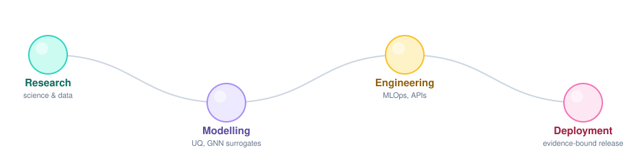

# Mohd Zamin Quadri

AI engineer in Munich. M.Sc. Mathematics in Science and Engineering, TUM.

I work on the part that comes after a model trains: whether it is calibrated,
whether anyone should trust a given prediction, and what happens when the world
moves away from the data it learned on.

<picture>
  <source media="(prefers-color-scheme: dark)" srcset="assets/pipeline-dark.svg">
  <source media="(prefers-color-scheme: light)" srcset="assets/pipeline-light.svg">
  
</picture>

Most of what is here carries its own evidence. Where a repository publishes a
number, something in it checks that number against the files that produced it,
because a figure in a README that nothing verifies is a claim, not a result.

**[mzquadri.de](https://mzquadri.de)** has the case studies and what each one
does not establish.

### A few things worth opening

| | |
|---|---|
| [**ml_surrogates_for_agent_based_transport_models**](https://github.com/mzquadri/ml_surrogates_for_agent_based_transport_models) | M.Sc. thesis. Six uncertainty-quantification methods on a graph neural network traffic surrogate. Calibration error down 90.5%; withholding the least reliable half of predictions cuts MAE by 41%. Forked from the chair's repository, with my contribution separated out in the README. |
| [**mcp-policy-gateway**](https://github.com/mzquadri/mcp-policy-gateway) | Runtime policy enforcement for Model Context Protocol tool calls. Catches 92.3% of an adversarial corpus at an 11.1% false positive rate, against a keyword baseline at 38.5%. Two scored misses are kept in the corpus rather than removed. |
| [**insureassist-rag-mlops**](https://github.com/mzquadri/insureassist-rag-mlops) | Retrieval over insurance policy documents, with citations that resolve to exact character offsets. Hybrid BM25 and dense retrieval, 3.3× top-document accuracy over the baseline. |
| [**drift-aware-ml-platform**](https://github.com/mzquadri/drift-aware-ml-platform) | Demand forecasting that watches its own target for drift. On this data only 9% of input features move while the target moves 0.679, so a feature-only monitor would miss a 63% rise in demand. |
| [**DPS**](https://github.com/mzquadri/DPS) | Munich road accident forecasting behind a FastAPI service. CI re-runs the pipeline and fails the build unless it reproduces the committed reference run to 1e-9. |
| [**UQ-Hydrology-Seminar-TUM**](https://github.com/mzquadri/UQ-Hydrology-Seminar-TUM) | Group seminar on uncertainty in a calibrated rainfall-runoff model. Rainfall noise barely touches the fit; measurement error in the observed discharge costs 0.148 NSE and recalibration recovers almost none of it. |

The index on the site lists every public repository, including the learning
exercises, because one that dropped them would be saying something else.

mohdzaminquadri@gmail.com · [LinkedIn](https://www.linkedin.com/in/mohdzaminquadri/)
